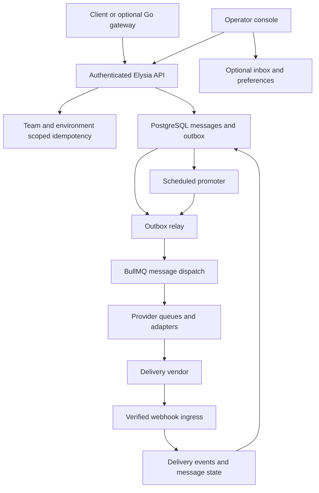

# Convey system architecture

Convey is a standalone, pre-release communication service built with Bun `1.4.0`, Elysia, Drizzle, PostgreSQL 18 and BullMQ backed by a Redis-compatible store. The implementation accepts messages durably, dispatches through provider adapters and records delivery events. Design utilities and benchmark results do not establish a throughput or multi-region availability guarantee.

## Runtime boundaries

| Component | Responsibility |
| --- | --- |
| `apps/server` | HTTP API, canonical database initialization, outbox/scheduling loops and BullMQ workers in one process. |
| `apps/web` | React operator console; production Bun server proxies requests to core and optional plugins. |
| `apps/plugins` | Optional inbox/preferences APIs; checks identity against the core session endpoint. |
| `apps/gateway` | Optional Go proxy for non-admin APIs, with pluggable recipient resolution and request transformation. |
| `apps/mock-server` | Local provider protocol simulator. |
| `apps/website` | Developer documentation website. |
| `packages/sdk`, `packages/sdk-go`, `packages/sdk-py` | Client SDKs. |

The gateway has its own runtime and Dockerfile; it is not included in the root Compose stack. See [gateway usage](../apps/gateway/USAGE.md) and its [adapter contract](../apps/gateway/README.md). The server uses PostgreSQL and Redis-compatible storage and external delivery vendors; being standalone refers to repository/framework boundaries, not absence of infrastructure dependencies.

## Message flow

### Acceptance and isolation

`POST /v1/messages` and `/v1/messages/bulk` validate the request using Zod schemas. A single message requires `idempotencyKey`, `userId`, `team`, `category`, two-character `country`, `recipients` and at least one typed `channels` entry. Priority values are `critical`, `transactional`, `normal` and `marketing`.

Authentication is enabled by default. Active keys join active tenants and the globally unique `team_owners` registry. The API checks database-backed role/scope and enforces message team and sandbox boundaries. Platform configuration requires a platform credential; message operations still enforce the credential's team. Revocation is checked on each request. See [security](security.md).

Idempotency reservations are scoped by team and sandbox environment. A completed duplicate returns the cached acceptance response; reusing a key for another payload yields `409`. Acceptance encrypts dispatch payloads and stores the message and dispatch outbox record transactionally for near-term work. A successful first acceptance returns `202` with `messageId`, `state` and `createdAt` (plus `scheduledAt` for explicit scheduling). Public IDs are opaque `msg_<ULID>` identifiers; acceptance is distinct from delivery.

### Scheduling and relay

The default scheduling horizon is 1,800 seconds (`BULLMQ_SCHEDULING_HORIZON_SECONDS`). Near-term work goes through the transactional outbox to delayed BullMQ jobs. More distant work stays as scheduled messages in PostgreSQL until the scheduled promoter atomically changes state and inserts outbox records as the message enters the horizon.

The relay claims pending rows using `FOR UPDATE SKIP LOCKED`, publishes deterministic jobs and records processing. Recoverable claims and retries handle interruption, but delivery to an external vendor is not an exactly-once transaction. Inspect [queue topology](queue-topology.md) and the [verification report](operations/hardening-verification.md) for recovery coverage.

### Dispatch and delivery

Dispatch workers apply routing and policy checks, construct provider tasks and enqueue provider work. Provider workers decrypt payloads, execute adapters, persist attempts/events and handle retry or fallback behavior. Provider bootstrap reads enabled database records with encrypted credentials; adapters receive explicit configuration. Uppercase vendor field names can be normalized inside those objects, but adapters do not automatically read process environment credentials. Updates can notify workers through Redis PubSub; no propagation-time guarantee is specified.

Catalog and manifest presence do not prove an adapter can deliver. Use the [provider implementation audit](provider-porting-matrix.md) and qualify the selected vendor protocol and callbacks. Budget accounting and failure behavior are described separately in the [budget contract](operations/budget-enforcement.md).

### Webhooks and lifecycle updates

Provider callbacks enter `/v1/webhooks/:provider` and the relevant status/incoming variants. Signature validation fails closed. Where a native provider verifier is unavailable, a trusted ingress gateway must validate the vendor and add Convey's timestamped HMAC over the exact request body. Unsigned ingress is permitted only by explicit non-production configuration.

Webhook workers update attempt and message lifecycle state. Customer webhook subscriptions dispatch signed outbound events. The DLQ endpoints select and replay failed messages; `failed` is a message state, and there is no `dlq` message-state enum. Message status, timelines, traces, receipts and replay are scoped to the credential's team/environment.

## Storage and encryption

The high-volume `messages`, `message_attempts`, `message_events` and `budget_ledger` tables use monthly range partitions. Message IDs encode creation time for bounded partition queries. Schema initialization creates partitions from three months back through six months ahead; maintenance continues while the service runs.

Payloads and provider credentials use authenticated AES-256-GCM envelopes with key versions. Production requires a distinct `PAYLOAD_ENCRYPTION_KEY` of at least 32 characters. Optional key rings retain older versions for decryption. Recipient identities are scoped by team, and durable revocation denies application decryption. Derived keys remain reproducible from the master, so revocation is not cryptographic erasure. External tenant KMS encryption is not implemented. See [configuration](configuration-env.md).

Convey has not had its first release. Canonical per-table SQL files define the complete schema; initialization fingerprints the baseline and rejects changed or unmarked existing schemas without modifying data. Baseline and stored queue-format changes require explicit fresh disposable stores. See [schema policy](operations/schema-baseline.md).

## Console, startup and operations

The production console forwards same-origin core and plugin requests to `CONVEY_API_INTERNAL_URL` and `CONVEY_PLUGINS_INTERNAL_URL`. Vite uses development proxies. Optional browser-visible Vite origins are build-time settings. Console credentials are kept in tab memory, and platform administration uses database-backed permissions.

`bootstrapService()` checks database and Redis connectivity, ensures partitions, initializes configured providers, registers provider workers and starts outbox relay/pruning, scheduled promotion and maintenance loops. The normal API entrypoint starts the listener after bootstrap. Workers share that process; there is no separate worker-start command in the package scripts.

`/health/liveness` reports a responding process; `/health/readiness` reports bootstrap readiness and component/worker state; `/health` actively checks DB and Redis connectivity. `/metrics` exposes Prometheus metrics. Restrict observability and administrative surfaces through your deployment network. See [metrics](operations/metrics.md) and [Docker deployment](deployment-docker.md).

On `SIGTERM`/`SIGINT`, the shutdown orchestrator marks readiness false, stops loops, awaits worker closures, flushes buffers and closes connections. Configure ingress removal and termination time and test recovery. Experimental geo-replication, consensus, routing and resilience helpers do not independently establish tested multi-region failover, an SLA or a zero-data-loss guarantee.
