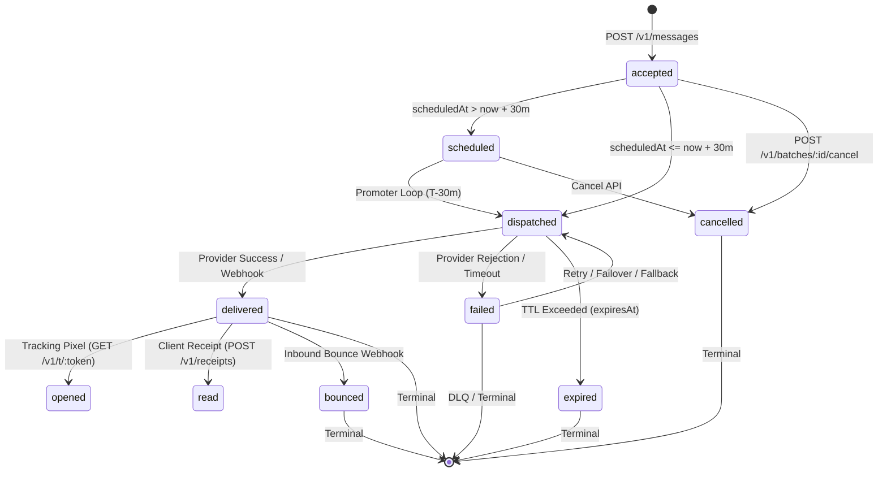

# Convey Message Lifecycle State Machine Specification

This document specifies the formal state machine, state transition rules, trigger events, database persistence invariants, and terminal conditions governing logical messages in Convey.

---

## 1. Lifecycle State Transition Diagram

```text
                               ┌──────────────────────────┐
                               │       POST /v1/messages  │
                               └─────────────┬────────────┘
                                             │
                                             ▼
                               ┌──────────────────────────┐
                               │         accepted         │ (Persisted in PostgreSQL & Outbox)
                               └─────────────┬────────────┘
                                             │
                       ┌─────────────────────┴─────────────────────┐
                       │ (scheduledAt > now + 30m)                 │ (scheduledAt <= now + 30m)
                       ▼                                           ▼
         ┌──────────────────────────┐                ┌──────────────────────────┐
         │        scheduled         │                │        dispatched        │ (Enqueued to BullMQ / Worker)
         └─────────────┬────────────┘                └─────────────┬────────────┘
                       │                                           │
                       │ (Promoted by scheduledPromoter)           │ (Provider Send Executed)
                       └─────────────────────►─────────────────────┘
                                             │
                       ┌─────────────────────┼─────────────────────┐
                       │                     │                     │
                       ▼                     ▼                     ▼
         ┌──────────────────────────┐  ┌───────────┐  ┌──────────────────────────┐
         │        delivered         │  │  failed   │  │         expired          │
         └─────────────┬────────────┘  └─────┬─────┘  │ (expiresAt < sendTime)   │
                       │                     │        └──────────────────────────┘
           ┌───────────┴───────────┐         │ (Failover / Fallback Evaluated)
           ▼                       ▼         ▼
     ┌───────────┐           ┌───────────┐ ┌────────────────────────────────────┐
     │  opened   │           │   read    │ │ fallback_retry (AttemptOrigin)     │
     │ (Pixel)   │           │(Receipt)  │ └─────────────────┬──────────────────┘
     └───────────┘           └───────────┘                   │
                                                             ▼ (If all retries/fallbacks exhausted)
                                                   ┌────────────────────────────┐
                                                   │    dlq / failed (Final)    │
                                                   └────────────────────────────┘
```



---

## 2. State Enum Definitions & Semantics

| State Enum | String Value | Category | Description |
| :--- | :--- | :--- | :--- |
| `MessageState.ACCEPTED` | `'accepted'` | Ingestion | Request has passed validation, zero-trust envelope encryption, and is committed to PostgreSQL `messages` and `outbox`. HTTP `202 Accepted` returned. |
| `MessageState.SCHEDULED`| `'scheduled'`| Scheduled | Message is scheduled for execution > 30 minutes in the future. Persisted in PostgreSQL ledger; awaits promotion by `scheduled-promoter.worker.ts`. |
| `MessageState.DISPATCHED`| `'dispatched'`| In-Flight | Job has been enqueued to BullMQ `dispatchQueue` or a dedicated provider queue (`bull:provider-send-*`) and is executing. |
| `MessageState.DELIVERED`| `'delivered'` | Terminal | Provider accepted dispatch and upstream delivery confirmation (webhook or synchronous 200) was received. |
| `MessageState.FAILED`   | `'failed'`    | Degraded / Terminal | Provider execution failed (e.g. 5xx, rate limit, timeout) or unrecoverable delivery error occurred. If fallbacks exist, may transition to new attempt. |
| `MessageState.EXPIRED`  | `'expired'`   | Terminal | Message `expiresAt` timestamp passed before delivery could be completed. Job is discarded to prevent stale delivery. |
| `MessageState.CANCELLED`| `'cancelled'` | Terminal | Message or parent campaign/batch was cancelled by client API before provider dispatch. |
| `MessageState.OPENED`   | `'opened'`    | Post-Delivery | Recipient opened email message; triggered by GET `/v1/t/:token` tracking pixel. |
| `MessageState.READ`     | `'read'`      | Post-Delivery | Recipient read receipt received from chat/push client via POST `/v1/receipts` or WhatsApp read webhook. |
| `MessageState.BOUNCED`  | `'bounced'`   | Terminal | Hard or soft bounce event reported by upstream email provider webhook. Automatically updates suppression engine. |

---

## 3. Formal State Transition Matrix

| Source State | Trigger / Event | Target State | Pre-conditions & Invariants | Side Effects & Actions |
| :--- | :--- | :--- | :--- | :--- |
| **`[*]`** | `POST /v1/messages` | `accepted` | Valid payload schema, team API key valid, Redis idempotency lock acquired. | Encrypts envelope via AES-256-GCM, inserts to `messages` + `outbox`, writes `message.accepted` audit log. |
| **`accepted`** | `outbox-relay` sweep | `scheduled` | `scheduledAt > NOW() + 30 minutes`. | Outbox record marked `processed`, message remains in PostgreSQL with `state = 'scheduled'`. |
| **`accepted`** | `outbox-relay` sweep | `dispatched` | `scheduledAt IS NULL` OR `scheduledAt <= NOW() + 30 minutes`. | Enqueues job to BullMQ `dispatchQueue`. Outbox record marked `processed`. |
| **`scheduled`** | `scheduledPromoter` loop | `dispatched` | `scheduledAt <= NOW() + 30 minutes`. | Promotes message to BullMQ delayed job (`delay = scheduledAt - NOW()`). Updates state to `dispatched`. |
| **`scheduled` / `accepted`** | Batch / Message Cancel API | `cancelled` | Message not yet dispatched to provider (`completedAt IS NULL`). | Sets `cancelledAt = NOW()`, updates state to `cancelled`, writes `message.cancelled` event. |
| **`dispatched`** | Provider send succeeds | `delivered` | Provider returns HTTP 200 / accepted status. | Inserts `message_attempts` (`state = 'delivered'`), sets `completedAt = NOW()`, increments Prometheus counter. |
| **`dispatched`** | Provider error / timeout | `failed` | Provider returns 4xx/5xx or timeout. | Inserts `message_attempts` (`state = 'failed'`). If retries/fallbacks remain, enqueues to `fallbackRetryQueue`. |
| **`dispatched`** | `NOW() > expiresAt` | `expired` | Expiration timestamp has passed. | Cancels provider dispatch, writes `message.expired` audit event. |
| **`delivered`** | Tracking Pixel Request | `opened` | `GET /v1/t/:token` matches valid message token. | Logs `message.opened` event, increments open metric bucket in `reports` rollup. |
| **`delivered`** | Client / Webhook Read Receipt | `read` | `POST /v1/receipts` or WhatsApp read status callback. | Logs `message.read` event, updates read metrics. |
| **`delivered`** | Inbound Bounce Webhook | `bounced` | Upstream provider posts hard bounce webhook. | Adds recipient hash to `suppressions` table, writes `message.bounced` event. |

---

## 4. Message Attempt Origin Tracking

Every provider dispatch attempt creates an immutable entry in `message_attempts`. The `origin` column distinguishes the execution context:

- **`AttemptOrigin.INITIAL` (`'initial'`)**: The primary provider dispatch attempt.
- **`AttemptOrigin.RETRY` (`'retry'`)**: Automatic retry against the same provider following transient network/rate-limit failure with exponential jitter backoff.
- **`AttemptOrigin.PROVIDER_FAILOVER` (`'provider_failover'`)**: Failover to an alternative provider within the same channel (e.g. `ses` ➔ `sendgrid`).
- **`AttemptOrigin.FALLBACK` (`'fallback'`)**: Cross-channel cascade execution (e.g. `whatsapp` ➔ `sms` ➔ `email`).

---

## 5. Audit Timeline Event Types

Convey records structured audit events in the range-partitioned `message_events` table:

```json
[
  { "type": "message.accepted", "occurredAt": "2026-08-16T22:42:00.000Z" },
  { "type": "provider.dispatch", "providerId": "whatsapp-business", "occurredAt": "2026-08-16T22:42:00.500Z" },
  { "type": "provider.failover", "fromProvider": "whatsapp-business", "toProvider": "twilio-whatsapp", "occurredAt": "2026-08-16T22:42:02.100Z" },
  { "type": "message.delivered", "providerId": "twilio-whatsapp", "occurredAt": "2026-08-16T22:42:03.200Z" },
  { "type": "message.opened", "occurredAt": "2026-08-16T22:45:10.000Z" }
]
```
